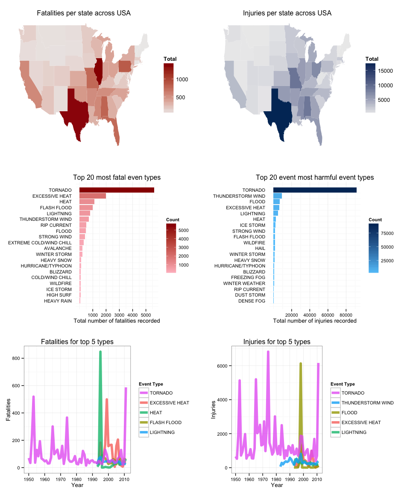
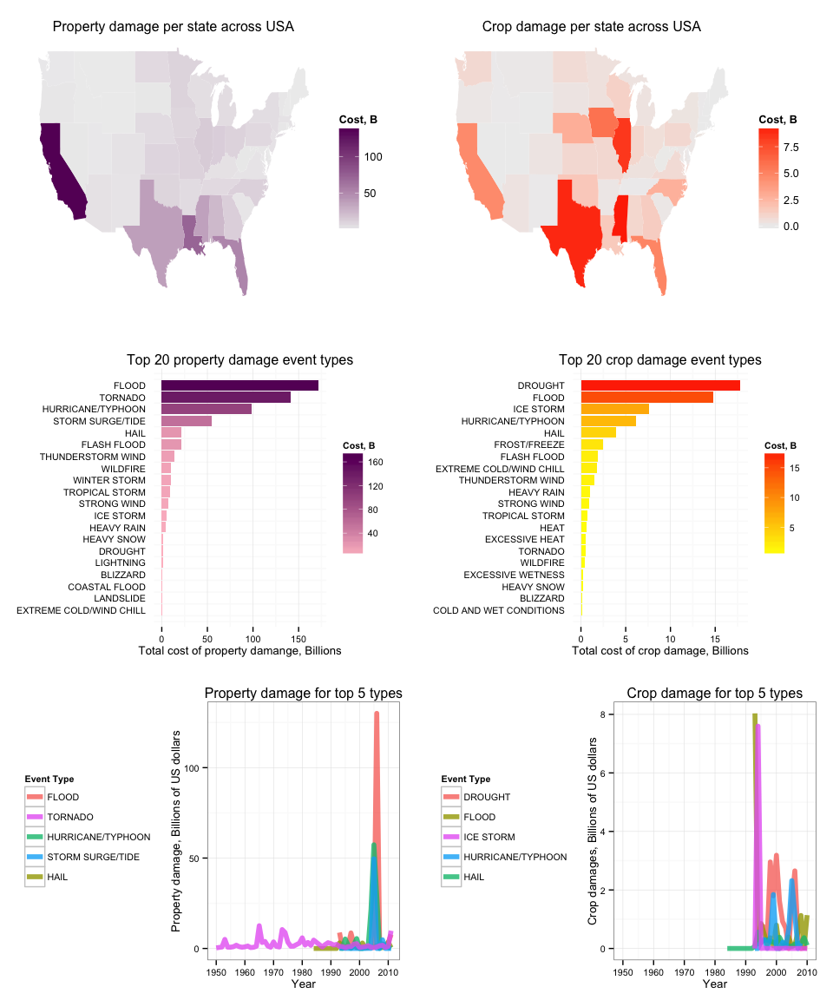

# Public health and economic consequnces of the severe weather events across the United States

## Summary/Synopsis   
This report focuses on analysis of storms and other severe weather events that cause both public health and economic problems for communities and municipalities. We have analyzed the U.S. National Oceanic and Atmospheric Administration's (NOAA) storm database for severe events that result in fatalities, injuries, property and crop damages.

We show that

///Tornadoes are the most harmful storm event for population health (as measured by injuries and fatalities). Heat/excessive heat is the largest single cause of fatalities per year. Flooding and thunderstorms both make a major contribution to injury and fatality totals.

Floods and hurricanes are the primary factors causing economic consequences. Tornadoes have caused much property damage over more years, and droughts are the primary additional factor causing crop damage.

Lastly, it is important to remember that these results vary greatly by locality. Any prevention/response planning should be based on a finer grained analysis (e.g. by state) taking into account local characteristics.///


## Data Processing   

Initializing and loading requried pakcages for processing and analysis

```r
require(knitr, quietly=TRUE)
opts_chunk$set(warning=FALSE, error=FALSE, message=FALSE)
```


```r
require(dplyr, quietly=TRUE)
require(lubridate, quietly=TRUE)
require(ggplot2, quietly=TRUE)
require(grid, quietly=TRUE)
require(gridExtra, quietly=TRUE)
require(scales, quietly=TRUE)
require(maps, quietly=TRUE)
data(state)
```

Downloading the databses file and load it into a data frame:

```r
# Load the data from https://d396qusza40orc.cloudfront.net/repdata%2Fdata%2FStormData.csv.bz2
fileUrl  <- "https://d396qusza40orc.cloudfront.net/repdata%2Fdata%2FStormData.csv.bz2"
fileName <- "stormData.csv.bz2"

if(!file.exists(fileName)) {
    download.file(fileUrl, destfile = fileName, method = "curl")
}

stormDF <- read.csv(fileName, stringsAsFactors=FALSE)
```

#### Creating tidy data set   

The next few steps are designed to produce the data set containing mainly variables used in the adta analysis grouped by state, year and storm / event type to identify eventa that result in most fatalities, injuriues, propety and crop damage across United States.   

Analysing the strucutre of the Storm Data set

```r
str(stormDF)
```

```
## 'data.frame':	902297 obs. of  37 variables:
##  $ STATE__   : num  1 1 1 1 1 1 1 1 1 1 ...
##  $ BGN_DATE  : chr  "4/18/1950 0:00:00" "4/18/1950 0:00:00" "2/20/1951 0:00:00" "6/8/1951 0:00:00" ...
##  $ BGN_TIME  : chr  "0130" "0145" "1600" "0900" ...
##  $ TIME_ZONE : chr  "CST" "CST" "CST" "CST" ...
##  $ COUNTY    : num  97 3 57 89 43 77 9 123 125 57 ...
##  $ COUNTYNAME: chr  "MOBILE" "BALDWIN" "FAYETTE" "MADISON" ...
##  $ STATE     : chr  "AL" "AL" "AL" "AL" ...
##  $ EVTYPE    : chr  "TORNADO" "TORNADO" "TORNADO" "TORNADO" ...
##  $ BGN_RANGE : num  0 0 0 0 0 0 0 0 0 0 ...
##  $ BGN_AZI   : chr  "" "" "" "" ...
##  $ BGN_LOCATI: chr  "" "" "" "" ...
##  $ END_DATE  : chr  "" "" "" "" ...
##  $ END_TIME  : chr  "" "" "" "" ...
##  $ COUNTY_END: num  0 0 0 0 0 0 0 0 0 0 ...
##  $ COUNTYENDN: logi  NA NA NA NA NA NA ...
##  $ END_RANGE : num  0 0 0 0 0 0 0 0 0 0 ...
##  $ END_AZI   : chr  "" "" "" "" ...
##  $ END_LOCATI: chr  "" "" "" "" ...
##  $ LENGTH    : num  14 2 0.1 0 0 1.5 1.5 0 3.3 2.3 ...
##  $ WIDTH     : num  100 150 123 100 150 177 33 33 100 100 ...
##  $ F         : int  3 2 2 2 2 2 2 1 3 3 ...
##  $ MAG       : num  0 0 0 0 0 0 0 0 0 0 ...
##  $ FATALITIES: num  0 0 0 0 0 0 0 0 1 0 ...
##  $ INJURIES  : num  15 0 2 2 2 6 1 0 14 0 ...
##  $ PROPDMG   : num  25 2.5 25 2.5 2.5 2.5 2.5 2.5 25 25 ...
##  $ PROPDMGEXP: chr  "K" "K" "K" "K" ...
##  $ CROPDMG   : num  0 0 0 0 0 0 0 0 0 0 ...
##  $ CROPDMGEXP: chr  "" "" "" "" ...
##  $ WFO       : chr  "" "" "" "" ...
##  $ STATEOFFIC: chr  "" "" "" "" ...
##  $ ZONENAMES : chr  "" "" "" "" ...
##  $ LATITUDE  : num  3040 3042 3340 3458 3412 ...
##  $ LONGITUDE : num  8812 8755 8742 8626 8642 ...
##  $ LATITUDE_E: num  3051 0 0 0 0 ...
##  $ LONGITUDE_: num  8806 0 0 0 0 ...
##  $ REMARKS   : chr  "" "" "" "" ...
##  $ REFNUM    : num  1 2 3 4 5 6 7 8 9 10 ...
```

Tidying up the variable names and adding "year" column to enable easier analysis per year

```r
names(stormDF) <- tolower(names(stormDF)) # tidy up the variabel names
stormDF$evtype <- toupper(stormDF$evtype)
stormDF$year <- year(as.Date(stormDF$bgn_date, "%m/%d/%Y"))
```

##### Converting state abbreviateion to the state names   
Storm DB contains data for all official US territories from 1950 to the end of 2011. We will specifically focus our analysis only on canonical 50 States.   

Comparing US State abbreviations in the data set with the canonical 50 States. 

```r
unique(stormDF$state); length(unique(stormDF$state))
```

```
##  [1] "AL" "AZ" "AR" "CA" "CO" "CT" "DE" "DC" "FL" "GA" "HI" "ID" "IL" "IN"
## [15] "IA" "KS" "KY" "LA" "ME" "MD" "MA" "MI" "MN" "MS" "MO" "MT" "NE" "NV"
## [29] "NH" "NJ" "NM" "NY" "NC" "ND" "OH" "OK" "OR" "PA" "RI" "SC" "SD" "TN"
## [43] "TX" "UT" "VT" "VA" "WA" "WV" "WI" "WY" "PR" "AK" "ST" "AS" "GU" "MH"
## [57] "VI" "AM" "LC" "PH" "GM" "PZ" "AN" "LH" "LM" "LE" "LS" "SL" "LO" "PM"
## [71] "PK" "XX"
```

```
## [1] 72
```

```r
state.abb; length(state.abb)
```

```
##  [1] "AL" "AK" "AZ" "AR" "CA" "CO" "CT" "DE" "FL" "GA" "HI" "ID" "IL" "IN"
## [15] "IA" "KS" "KY" "LA" "ME" "MD" "MA" "MI" "MN" "MS" "MO" "MT" "NE" "NV"
## [29] "NH" "NJ" "NM" "NY" "NC" "ND" "OH" "OK" "OR" "PA" "RI" "SC" "SD" "TN"
## [43] "TX" "UT" "VT" "VA" "WA" "WV" "WI" "WY"
```

```
## [1] 50
```

```r
states <- data.frame(state = state.abb, 
                     state_name = tolower(state.name), 
                     stringsAsFactors = FALSE)
```

See refernces for more infomration on US officlal states and territories.

We will add a colum with US official state names to enale per state analysis of the events.

```r
# NOTE: left_join hangs R session if state_name colum already exist in stormDF data frame
stormDF$state_name <- NULL
stormDF <- left_join(stormDF, states, by="state")
```


##### Damage information analysis and adjustment   

We need to normalize exponents of the property and crop damages first. Then we will adjast the damage cost base on Consumer Price Index yearly inflation index.   

First we notice discrete nature of the exponent data and some garbage that needs to be accoutned for while computing the cost of propery and crop damanges.   

```r
unique(stormDF$propdmgexp)
```

```
##  [1] "K" "M" ""  "B" "m" "+" "0" "5" "6" "?" "4" "2" "3" "h" "7" "H" "-"
## [18] "1" "8"
```

```r
unique(stormDF$cropdmgexp)
```

```
## [1] ""  "M" "K" "m" "B" "?" "0" "k" "2"
```

We will factorize the exponents and map them to the numeric values and compute property and crop damages.   


```r
levels(as.factor(stormDF$propdmgexp))
```

```
##  [1] ""  "-" "?" "+" "0" "1" "2" "3" "4" "5" "6" "7" "8" "B" "h" "H" "K"
## [18] "m" "M"
```

```r
levels(as.factor(stormDF$cropdmgexp))
```

```
## [1] ""  "?" "0" "2" "B" "k" "K" "m" "M"
```

Creating mumerical exponents vectors that correspomd to the above, converting property and crop damages into proper numerical form for furtehr analysis. 


```r
numpropexp <- c(0, 0, 0, 0, 0, 1:8, 9, 2, 2, 3, 6, 6)
numcropexp <- c(0, 0, 0, 2, 9, 3, 3, 6, 6)

stormDF$propdamage <- stormDF$propdmg * 10^numpropexp[as.numeric(as.factor(stormDF$propdmgexp))]
stormDF$cropdamage <- stormDF$cropdmg * 10^numcropexp[as.numeric(as.factor(stormDF$cropdmgexp))]
```

We use 2011 dollars to normalize and calculate the damage costs for the entire Storm dataset to enale accurate year to year damage cost analysis.   


```r
# compute adjustment factor based on Consumer Price Index data (CPI)
cpi <- read.csv("http://research.stlouisfed.org/fred2/data/CPIAUCSL.csv", header = TRUE)
cpi$year <- year(cpi$DATE)
indx <- cpi %>% group_by(year) %>% summarize(indx = mean(VALUE))
indx$indx <- indx$indx[indx$year == max(stormDF$year)]/indx$indx

# adjsut costs to 2011 dollars
stormDF$propdamage <- stormDF$propdamage * left_join(stormDF, indx, by="year")$indx
stormDF$cropdamage <- stormDF$cropdamage * left_join(stormDF, indx, by="year")$indx
```

For our tidy data set we will select only the variables that are used in the current analysis


```r
stormDF <- select(stormDF, 
                  state_name, year, evtype, 
                  fatalities, injuries, propdamage, cropdamage)
str(stormDF)
```

```
## 'data.frame':	902297 obs. of  7 variables:
##  $ state_name: chr  "alabama" "alabama" "alabama" "alabama" ...
##  $ year      : num  1950 1950 1951 1951 1951 ...
##  $ evtype    : chr  "TORNADO" "TORNADO" "TORNADO" "TORNADO" ...
##  $ fatalities: num  0 0 0 0 0 0 0 0 1 0 ...
##  $ injuries  : num  15 0 2 2 2 6 1 0 14 0 ...
##  $ propdamage: num  233693 23369 216501 21650 21650 ...
##  $ cropdamage: num  0 0 0 0 0 0 0 0 0 0 ...
```

```r
head(stormDF,20)
```

```
##    state_name year  evtype fatalities injuries  propdamage cropdamage
## 1     alabama 1950 TORNADO          0       15   233693.16          0
## 2     alabama 1950 TORNADO          0        0    23369.32          0
## 3     alabama 1951 TORNADO          0        2   216500.58          0
## 4     alabama 1951 TORNADO          0        2    21650.06          0
## 5     alabama 1951 TORNADO          0        2    21650.06          0
## 6     alabama 1951 TORNADO          0        6    21650.06          0
## 7     alabama 1951 TORNADO          0        1    21650.06          0
## 8     alabama 1952 TORNADO          0        0    21166.53          0
## 9     alabama 1952 TORNADO          1       14   211665.31          0
## 10    alabama 1952 TORNADO          0        0   211665.31          0
## 11    alabama 1952 TORNADO          0        3 21166530.74          0
## 12    alabama 1952 TORNADO          0        3 21166530.74          0
## 13    alabama 1952 TORNADO          1       26  2116653.07          0
## 14    alabama 1952 TORNADO          0       12        0.00          0
## 15    alabama 1952 TORNADO          0        6   211665.31          0
## 16    alabama 1952 TORNADO          4       50   211665.31          0
## 17    alabama 1952 TORNADO          0        2   211665.31          0
## 18    alabama 1952 TORNADO          0        0   211665.31          0
## 19    alabama 1952 TORNADO          0        0   211665.31          0
## 20    alabama 1952 TORNADO          0        0   211665.31          0
```


#### Storm Events categories normalization

We observe that number of unique severe weatehr event types recorded in Storm Databse significantly larger than 96 describd in Storm Data Event Table from "NATIONAL WEATHER SERVICE INSTRUCTION 10-1605" (see References section)


```r
length(unique(stormDF$evtype))
```

```
## [1] 898
```

Looking at the freqency of terms used and comparing to the documented standard 96 types we obeserve a number of duplicate types that need to nbe combined to accurately reflect the total impact form a given type of an event.


```r
stdf <- stormDF %>%
    group_by(evtype) %>%
    summarise(n = n()) %>%
    arrange(desc(n))
stdf
```

```
## Source: local data frame [898 x 2]
## 
##                evtype      n
## 1                HAIL 288661
## 2           TSTM WIND 219942
## 3   THUNDERSTORM WIND  82564
## 4             TORNADO  60652
## 5         FLASH FLOOD  54277
## 6               FLOOD  25327
## 7  THUNDERSTORM WINDS  20843
## 8           HIGH WIND  20214
## 9           LIGHTNING  15754
## 10         HEAVY SNOW  15708
## ..                ...    ...
```

While categorizing all `898` recorded event types into `96` standard ones is by far beyond this particular report, we are going to account for some duplication and consolidate events across most frequent ones - analysing  top 50 most frequent event types in the data set.


```r
evtlookup <- function(s, v = T) {
    unique(grep(toupper(s), toupper(stormDF$evtype),value = v, perl=T))
}
```


```r
stdf[1:50,]
```

```
## Source: local data frame [50 x 2]
## 
##                      evtype      n
## 1                      HAIL 288661
## 2                 TSTM WIND 219942
## 3         THUNDERSTORM WIND  82564
## 4                   TORNADO  60652
## 5               FLASH FLOOD  54277
## 6                     FLOOD  25327
## 7        THUNDERSTORM WINDS  20843
## 8                 HIGH WIND  20214
## 9                 LIGHTNING  15754
## 10               HEAVY SNOW  15708
## 11               HEAVY RAIN  11742
## 12             WINTER STORM  11433
## 13           WINTER WEATHER   7045
## 14             FUNNEL CLOUD   6844
## 15         MARINE TSTM WIND   6175
## 16 MARINE THUNDERSTORM WIND   5812
## 17               WATERSPOUT   3796
## 18              STRONG WIND   3569
## 19     URBAN/SML STREAM FLD   3392
## 20                 WILDFIRE   2761
## 21                 BLIZZARD   2719
## 22                  DROUGHT   2488
## 23                ICE STORM   2006
## 24           EXCESSIVE HEAT   1678
## 25               HIGH WINDS   1533
## 26         WILD/FOREST FIRE   1457
## 27             FROST/FREEZE   1343
## 28                DENSE FOG   1293
## 29       WINTER WEATHER/MIX   1104
## 30           TSTM WIND/HAIL   1028
## 31  EXTREME COLD/WIND CHILL   1002
## 32                     HEAT    767
## 33                HIGH SURF    734
## 34           TROPICAL STORM    690
## 35           FLASH FLOODING    682
## 36             EXTREME COLD    657
## 37            COASTAL FLOOD    656
## 38         LAKE-EFFECT SNOW    636
## 39        FLOOD/FLASH FLOOD    625
## 40                     SNOW    617
## 41                LANDSLIDE    600
## 42          COLD/WIND CHILL    539
## 43                      FOG    538
## 44              RIP CURRENT    470
## 45              MARINE HAIL    442
## 46               DUST STORM    427
## 47                AVALANCHE    386
## 48                     WIND    346
## 49             RIP CURRENTS    304
## 50              STORM SURGE    261
```

```r
# regex bulk updates
stormDF$evtype[evtlookup("heavy rain", v=F)] = "HEAVY RAIN"
stormDF$evtype[evtlookup("hail", v=F)] = "HAIL"
stormDF$evtype[evtlookup("tornado", v=F)] = "TORNADO"

stormDF$evtype[evtlookup("drought", v=F)] = "DROUGHT"
stormDF$evtype[evtlookup("(record|excessive|extreme).*heat", v=F)] = "EXCESSIVE HEAT"
stormDF$evtype[evtlookup("heat wave", v=F)] = "HEAT"

stormDF$evtype[evtlookup("flash", v=F)] = "FLASH FLOOD"
stormDF$evtype[evtlookup("coastal flood", v=F)] = "COASTAL FLOOD"
stormDF$evtype[evtlookup("^(?!flash|coastal).*flood", v=F)] = "FLOOD"

stormDF$evtype[evtlookup("ice storm", v=F)] = "ICE STORM"
stormDF$evtype[evtlookup("avalanche", v=F)] = "AVALANCHE"
stormDF$evtype[evtlookup("blizzard", v=F)] = "BLIZZARD"
stormDF$evtype[evtlookup("(extreme).*wind.*ch", v=F)] = "EXTREME COLD/WIND CHILL"
stormDF$evtype[evtlookup("(extreme|record|excessive).*cold", v=F)] = "EXTREME COLD/WIND CHILL"
stormDF$evtype[evtlookup("^(?!extreme).*wind ch", v=F)] = "COLD/WIND CHILL"
stormDF$evtype[evtlookup("(heavy|record|excessive).*snow", v=F)] = "HEAVY SNOW"
stormDF$evtype[stormDF$evtype == "SNOW"] = "HEAVY SNOW"
stormDF$evtype[evtlookup("freeze|frost", v=F)] = "FROST/FREEZE"
stormDF$evtype[evtlookup("sleet", v=F)] = "SLEET"
stormDF$evtype[evtlookup("winter weather", v=F)] = "WINTER WEATHER"

stormDF$evtype[evtlookup("hurricane|typhoon", v=F)] = "HURRICANE/TYPHOON"
stormDF$evtype[evtlookup("^(?!marine).*thunderstorm", v=F)] = "THUNDERSTORM WIND"
stormDF$evtype[evtlookup("^(?!marine).*tstm", v=F)] = "THUNDERSTORM WIND"
stormDF$evtype[stormDF$evtype == "MARINE TSTM WIND"] = "MARINE THUNDERSTORM WIND"
stormDF$evtype[evtlookup("^(high|strong).*wind", v=F)] = "STRONG WIND"
stormDF$evtype[stormDF$evtype == "WIND"] = "STRONG WIND"
stormDF$evtype[stormDF$evtype == "STORM SURGE"] = "STORM SURGE/TIDE"

stormDF$evtype[evtlookup("(dense).*fog", v=F)] = "DENSE FOG"
stormDF$evtype[evtlookup("^(?!dense).*fog", v=F)] = "FREEZING FOG"
stormDF$evtype[evtlookup("fire", v=F)] ="WILDFIRE"
stormDF$evtype[evtlookup("current", v=F)] ="RIP CURRENT"
```

#### Finalizing the tidy data set

Lastly we will group event by year and state and limit our analysis only to 50 canoncial states including only events that resulted in one or more health and/or economic problems(fatalities, injuries, property and crop damage)


```r
stormDF <- stormDF %>% 
    filter(!(is.na(stormDF$state_name))) %>%
    filter(fatalities > 0 |
             injuries > 0 |
           propdamage > 0 |
           cropdamage > 0) %>%
    group_by(year, state_name, evtype) %>%
    summarize(fatalities = sum(fatalities),
                injuries = sum(injuries),
              propdamage = sum(propdamage),
              cropdamage = sum(cropdamage))
stormDF
```

```
## Source: local data frame [11,998 x 7]
## Groups: year, state_name
## 
##    year  state_name  evtype fatalities injuries   propdamage cropdamage
## 1  1950     alabama TORNADO          0       15 2.570625e+05          0
## 2  1950    arkansas TORNADO          2       49 8.039325e+06          0
## 3  1950    colorado TORNADO          0        1 4.673863e+05          0
## 4  1950 connecticut TORNADO          0        3 2.360301e+06          0
## 5  1950     florida TORNADO          0        0 7.711874e+05          0
## 6  1950     georgia TORNADO          0        1 3.038011e+05          0
## 7  1950    illinois TORNADO          3       31 5.494126e+07          0
## 8  1950     indiana TORNADO          0        0 2.336932e+05          0
## 9  1950        iowa TORNADO          0        5 2.804318e+02          0
## 10 1950      kansas TORNADO          1       26 4.760330e+07          0
## ..  ...         ...     ...        ...      ...          ...        ...
```

## Results


```r
fatal_usa <- stormDF %>% 
    group_by(evtype) %>%
    summarise(fatal_total = sum(fatalities)) %>%
    arrange(desc(fatal_total)) %>%
    mutate(rank=1:nrow(.))
```


```r
injury_usa <- stormDF %>%
    group_by(evtype) %>%
    summarise(injury_total = sum(injuries)) %>%
    arrange(desc(injury_total)) %>%
    mutate(rank=1:nrow(.))
```


```r
fatal_state <- stormDF %>% 
    group_by(state_name) %>% 
    summarize(fatal_total = sum(fatalities)) %>%
    arrange(desc(fatal_total))
```


```r
injury_state <- stormDF %>% 
    group_by(state_name) %>%
    summarise(injury_total = sum(injuries)) %>%
    arrange(desc(injury_total))
```


```r
fatal_year <- stormDF %>%
    filter(evtype %in% fatal_usa$evtype[1:5]) %>%
    group_by(year, evtype) %>%
    summarise(fatal_total=sum(fatalities)) %>%
    arrange(year)
```


```r
injury_year <- stormDF %>%
    filter(evtype %in% injury_usa$evtype[1:5]) %>%
    group_by(year, evtype) %>%
    summarise(injury_total=sum(injuries)) %>%
    arrange(year)
```


```r
states_map <- map_data("state")

theme_map <- theme(plot.title = element_text(size = 12),
                   axis.title = element_blank(),
                   axis.text = element_blank(),
                   axis.ticks = element_blank(),
                   panel.border = element_blank(),
                   panel.grid = element_blank(),
                   panel.background = element_rect(fill = "white",  colour = NA))

theme_bar <- theme(axis.title.y = element_blank(),
                   axis.ticks.y = element_blank(),
                   panel.grid.major.y = element_blank(),
                   panel.border = element_blank()
                   )
```


```r
g1 <- ggplot(fatal_state, aes(map_id = state_name)) + 
    geom_map(aes(fill = fatal_total), map = states_map) +
    scale_fill_gradient("Total", low = "#EEEEEE", high = "#990000") +
    expand_limits(x = states_map$long, y = states_map$lat) +
    ggtitle("Fatalities per state across USA") +
    theme_map
   
g2 <- ggplot(injury_state, aes(map_id = state_name)) + 
    geom_map(aes(fill = injury_total), map = states_map) +
    scale_fill_gradient("Total", low = "#EEEEEE", high = "#003366") +
    expand_limits(x = states_map$long, y = states_map$lat) +
    ggtitle("Injuries per state across USA") +
    theme_map

g3 <- ggplot(fatal_usa[1:20,], aes(x=rank, y=fatal_total, fill=fatal_total)) +
    geom_bar(stat="identity") + coord_flip() +
    scale_fill_gradient("Count", low = "pink", high = "#990000") +
    scale_x_reverse(breaks=1:20, labels=fatal_usa$evtype[1:20]) + 
    scale_y_continuous(breaks=c(1000, 2000, 3000, 4000, 5000)) +
    ggtitle("Top 20 most fatal even types") +
    ylab("Total number of fatalities recorded") +
    theme_bw(base_size = 10) +
    theme_bar
    
g4 <- ggplot(injury_usa[1:20,], aes(x=rank, y=injury_total, fill=injury_total)) +
    geom_bar(stat="identity") + coord_flip() +
    scale_fill_gradient("Count", low = "#66CCFF", high = "#003366") +
    scale_x_reverse(breaks=1:20, labels=injury_usa$evtype[1:20]) + 
    scale_y_continuous(breaks=c(20000, 40000, 60000, 80000)) +
    ggtitle("Top 20 event most harmful event types") +
    ylab("Total number of injuries recorded") +
    theme_bw(base_size = 10) +
    theme_bar

g5 <- ggplot(fatal_year, aes(x=year, y=fatal_total, colour = evtype)) +
    geom_line(size = 2, alpha = 0.8) +
    scale_colour_discrete(name="Event Type", breaks=fatal_usa$evtype[1:5]) +
    scale_x_continuous(breaks=c(1950, 1960, 1970, 1980, 1990, 2000, 2010)) +
    ggtitle("Fatalities for top 5 types") +
    xlab("Year") + ylab("Fatalities") +
    theme_bw(base_size = 10)

g6<- ggplot(injury_year, aes(x=year, y=injury_total, colour = evtype)) +
    geom_line(size = 2, alpha = 0.8) +
    scale_colour_discrete(name="Event Type", breaks=injury_usa$evtype[1:5]) +
    scale_x_continuous(breaks=c(1950, 1960, 1970, 1980, 1990, 2000, 2010)) +
    ggtitle("Injuries for top 5 types") +
    xlab("Year") + ylab("Injuries") +
    theme_bw(base_size = 10)
#g6
grid.arrange(g1, g2, g3, g4, g5, g6, ncol=2)
```




```r
prop_usa <- stormDF %>% 
    group_by(evtype) %>%
    summarise(prop_total = sum(propdamage)) %>%
    arrange(desc(prop_total)) %>%
    mutate(rank=1:nrow(.))
```


```r
crop_usa <- stormDF %>%
    group_by(evtype) %>%
    summarise(crop_total = sum(cropdamage)) %>%
    arrange(desc(crop_total)) %>%
    mutate(rank=1:nrow(.))
```


```r
prop_state <- stormDF %>% 
    group_by(state_name) %>% 
    summarize(prop_total = sum(propdamage)) %>%
    arrange(desc(prop_total))
```


```r
crop_state <- stormDF %>% 
    group_by(state_name) %>%
    summarise(crop_total = sum(cropdamage)) %>%
    arrange(desc(crop_total))
```


```r
prop_year <- stormDF %>%
    filter(evtype %in% prop_usa$evtype[1:5]) %>%
    group_by(year, evtype) %>%
    summarise(damage=sum(propdamage)) %>%
    arrange(year)
```


```r
crop_year <- stormDF %>%
    filter(evtype %in% crop_usa$evtype[1:5]) %>%
    group_by(year, evtype) %>%
    summarise(damage=sum(cropdamage)) %>%
    arrange(year)
```


```r
g7 <- ggplot(prop_state, aes(map_id = state_name)) + 
    geom_map(aes(fill = prop_total/10^9), map = states_map) +
    scale_fill_gradient("Cost, B", low = "#EEEEEE", high = "#660066") +
    expand_limits(x = states_map$long, y = states_map$lat) +
    ggtitle("Property damage per state across USA") +
    theme_map
   
g8 <- ggplot(crop_state, aes(map_id = state_name)) + 
    geom_map(aes(fill = crop_total/10^9), map = states_map) +
    scale_fill_gradient("Cost, B", low = "#EEEEEE", high = "#FF3300") +
    expand_limits(x = states_map$long, y = states_map$lat) +
    ggtitle("Crop damage per state across USA") +
    theme_map

g9 <- ggplot(prop_usa[1:20,], aes(x=rank, y=prop_total, fill=prop_total/10^9)) +
    geom_bar(stat="identity") + coord_flip() +
    scale_fill_gradient("Cost, B", low = "pink", high = "#660066") +
    scale_x_reverse(breaks=1:20, labels=prop_usa$evtype[1:20]) + 
    scale_y_continuous(labels=c(0, 50, 100, 150, 200)) +
    ggtitle("Top 20 property damage event types") +
    ylab("Total cost of property damange, Billions") +
    theme_bw(base_size = 10) +
    theme_bar
    
g10 <- ggplot(crop_usa[1:20,], aes(x=rank, y=crop_total, fill=crop_total/10^9)) +
    geom_bar(stat="identity") + coord_flip() +
    scale_fill_gradient("Cost, B", low = "#FFFF00", high = "#FF3300") +
    scale_x_reverse(breaks=1:20, labels=crop_usa$evtype[1:20]) + 
    scale_y_continuous(labels=c(0, 5, 10, 15, 20)) +
    ggtitle("Top 20 crop damage event types") +
    ylab("Total cost of crop damage, Billions") +
    theme_bw(base_size = 10) +
    theme_bar

g11 <- ggplot(prop_year, aes(x=year, y=damage, colour = evtype)) +
    geom_line(size = 2, alpha = 0.8) +
    scale_colour_discrete(name="Event Type", breaks=prop_usa$evtype[1:5]) +
    scale_x_continuous(breaks=c(1950, 1960, 1970, 1980, 1990, 2000, 2010)) +
    scale_y_continuous(labels=c(0, 50, 100, 150)) +
    ggtitle("Property damage for top 5 types") +
    xlab("Year") + ylab("Property damage, Billions of US dollars") +
    theme_bw(base_size = 10) +
    theme(legend.position="left")

g12<- ggplot(crop_year, aes(x=year, y=damage, colour = evtype)) +
    geom_line(size = 2, alpha = 0.8) +
    scale_colour_discrete(name="Event Type", breaks=crop_usa$evtype[1:5]) +
    scale_x_continuous(limits=c(1950, 2010), breaks=c(1950, 1960, 1970, 1980, 1990, 2000, 2010)) +
    scale_y_continuous(labels=c(0, 2, 4, 6, 8)) +
    ggtitle("Crop damage for top 5 types") +
    xlab("Year") + ylab("Crop damages, Billions of US dollars") +
    theme_bw(base_size = 10) +
    theme(legend.position="left")

#g12
grid.arrange(g7, g8, g9, g10, g11, g12, ncol=2)
```




## References

http://en.wikipedia.org/wiki/List_of_U.S._state_abbreviations
https://d396qusza40orc.cloudfront.net/repdata%2Fpeer2_doc%2Fpd01016005curr.pdf

